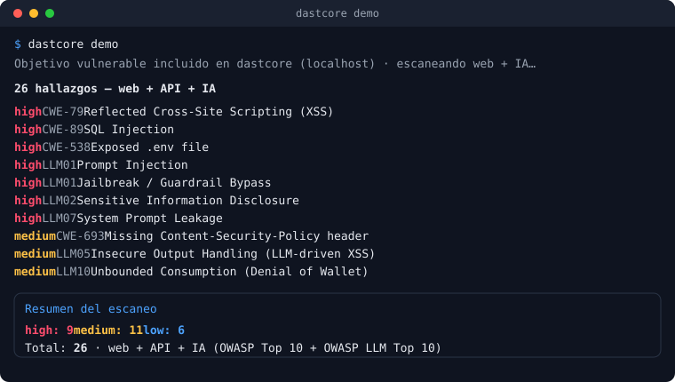

# dastcore

[](https://github.com/Proaso17/Dastcore/actions/workflows/ci.yml)
[](LICENSE)
[](https://www.python.org/)
[](https://owasp.org/www-project-top-10-for-large-language-model-applications/)

Escáner de seguridad de aplicaciones **dinámico** (caja negra) para **web, APIs y chatbots/LLMs**. Gemelo dinámico de `sastcore`.

<p align="center"></p>

> ⚠️ **Uso responsable.** `dastcore` es una herramienta de pentesting activa e intrusiva.
> No la ejecutes contra sistemas para los que no tengas autorización explícita.
> Cada escaneo requiere el flag `--i-have-authorization` y una configuración de scope.
> Lee [SECURITY.md](SECURITY.md) antes de usarlo.

## Qué hace

- **AI / LLM hacking** (`dastcore ai`): 13 clases de ataque contra chatbots/LLMs (**OWASP LLM Top 10**) — prompt injection (directa e **indirecta/RAG**), **jailbreaks multi-turno (crescendo)**, **fuga encadenada del system prompt**, divulgación de secretos/**PII**, **excessive agency** (tool-calling), **exfiltración de datos vía markdown/URL**, **bypass de seguridad / contenido dañino**, manejo inseguro de la salida y **denial of wallet** — con confirmación de bajo ruido (*canary*, oráculo diferencial, detección de PII con Luhn, clasificador de rechazo). Presets para OpenAI/Anthropic/Ollama/… y wordlists de jailbreak de la comunidad.
- **Crawler dual**: HTTP estático + headless (Playwright) para SPAs, endpoints XHR/fetch y DOM-XSS.
- **Descubrimiento de API por esquema**: OpenAPI/Swagger 2.0/3.x + introspección GraphQL.
- **OAST**: confirmación out-of-band de vulnerabilidades ciegas (blind SSRF/RCE/XXE/SSTI/CRLF, **Log4Shell/JNDI**) → cero falsos positivos en esa clase.
- **Autorización multi-sesión**: BOLA/IDOR, BFLA y endpoints sin autenticación con varias identidades/roles.

### Clases de vulnerabilidad cubiertas

| Clase | Cómo | CWE / OWASP |
|---|---|---|
| SQL Injection (error + blind time-based) | regla YAML | CWE-89 / WSTG-INPV-05 |
| NoSQL Injection (error-based) | regla YAML | CWE-943 / WSTG-INPV-05 |
| XSS reflejado (múltiples contextos) + DOM-based | regla YAML + headless | CWE-79 / WSTG-INPV-01 |
| SSTI (in-band `7*7` + blind OAST) | regla YAML | CWE-1336 / WSTG-INPV-18 |
| Command injection (blind, OAST) | regla YAML | CWE-78 / WSTG-INPV-12 |
| **Log4Shell / JNDI** (blind, OAST, incl. headers) | regla YAML | CWE-502 |
| SSRF (blind, OAST) | regla YAML | CWE-918 / WSTG-INPV-19 |
| XXE (blind, OAST) | regla YAML | CWE-611 / WSTG-INPV-07 |
| CRLF / HTTP header injection (OAST) | regla YAML | CWE-93 / WSTG-INPV-16 |
| Path traversal / LFI | regla YAML | CWE-22 / WSTG-ATHZ-01 |
| Open redirect | regla YAML | CWE-601 / WSTG-CLNT-04 |
| **Host header injection** | regla YAML (headers) | CWE-644 / WSTG-INPV-17 |
| CORS mal configurado (wildcard+creds **y origin reflejado**) | pasivo + activo | CWE-942 / WSTG-CLNT-07 |
| BOLA/IDOR, BFLA, missing-auth | detector multi-sesión | CWE-639/285/306 / API1/5/2 |
| Exposición de ficheros sensibles (`.env`, `.git`, claves) | detector activo | CWE-538 / WSTG-CONF-04 |
| GraphQL introspection habilitada | detector activo | CWE-200 / WSTG-APIT-01 |
| Cabeceras/cookies inseguras, CSP/HSTS ausentes, directory listing, stack traces, divulgación de tecnología | pasivos | varios |
| **LLM: prompt injection (directa+indirecta), jailbreak, crescendo multi-turno, system-prompt leak, secretos/PII, excessive agency, output inseguro, denial of wallet** | `dastcore ai` | OWASP LLM01/02/05/06/07/10 |
- **Bajo ruido**: cada hallazgo pasa un oráculo de validación (diferencial, temporal, reflejo, ejecución DOM u OAST) antes de reportarse.
- **Motor async con concurrencia**: escaneo paralelo acotado (`--concurrency`), rate limiting (`--rps`), backoff ante HTTP 429, y presupuesto global (`--max-requests` / `--time-budget`) para escaneos seguros y acotados.
- **Salidas**: JSON, SARIF 2.1.0 (CI/CD) y HTML autocontenido.

## Quickstart

```powershell
py -m venv .venv
.venv\Scripts\pip install -e ".[dev]"
.venv\Scripts\python -m playwright install chromium   # para --engine headless|both

# Pruébalo al instante contra un objetivo vulnerable incluido (web + IA, sin configurar nada)
.venv\Scripts\dastcore demo

# Escaneo rápido (estático), reporte a stdout
.venv\Scripts\dastcore scan http://127.0.0.1:5000 --i-have-authorization --profile quick

# Escaneo completo con SARIF para CI/CD (falla el build con exit 2 si hay high/critical)
.venv\Scripts\dastcore scan http://127.0.0.1:5000 --i-have-authorization --profile full -f sarif -o out.sarif --fail-on high
```

Probar un chatbot / LLM (OWASP LLM Top 10). Con **presets de proveedor** no hace falta configurar nada:

```powershell
# OpenAI (y compatibles: vLLM, LM Studio, Groq, Together, Mistral, DeepSeek…)
.venv\Scripts\dastcore ai https://api.openai.com/v1/chat/completions --i-have-authorization `
  --ai-preset openai --ai-model gpt-4o-mini --ai-key "sk-..."

# Anthropic
.venv\Scripts\dastcore ai https://api.anthropic.com/v1/messages --i-have-authorization `
  --ai-preset anthropic --ai-model claude-3-5-sonnet-latest --ai-key "sk-ant-..."

# Ollama local (sin auth)
.venv\Scripts\dastcore ai http://localhost:11434/api/chat --i-have-authorization --ai-preset ollama --ai-model llama3

# Endpoint propio {"message": "..."} -> {"reply": "..."} (sin preset)
.venv\Scripts\dastcore ai https://tu-bot.example/chat --i-have-authorization
```

Presets disponibles: `openai`, `azure-openai`, `anthropic`, `ollama`, `cohere`, `huggingface`, `gemini`. Para APIs no listadas, `--ai-template` (con `{{prompt}}` o `{{messages}}`) + `--ai-response-path` cubren cualquier forma — y puedes guardarla una vez en un fichero y reutilizarla con `--ai-config myapi.yaml`. Amplía los jailbreaks con tu propia wordlist: `--ai-wordlist jailbreaks.txt`.

Si el endpoint responde en **streaming** (SSE/NDJSON, típico de OpenAI/Ollama), añade `--ai-stream` y dastcore reensambla los *deltas* automáticamente. El reporte HTML de `dastcore ai` (`-f html -o report.html`) se agrupa por categoría OWASP LLM.

Documentación: **[Manual de uso](docs/manual.html)** (guía visual con capturas: CLI, panel web y cloud) · [RULES.md](RULES.md) (cómo escribir una regla) · [SECURITY.md](SECURITY.md) (uso responsable) · [`examples/github-action.yml`](examples/github-action.yml) (CI/CD).

## Estado del proyecto

- [x] Fase 0 — Bootstrap (config, scope, CLI con gate legal)
- [x] Fase 0.5 — Target vulnerable local para tests
- [x] Fase 1 — Motor de red y descubrimiento HTTP
- [x] Fase 2 — Motor de reglas y escaneo activo básico
- [x] Fase 3 — Autenticación y sesiones
- [x] Fase 4 — Reportes (JSON/SARIF/HTML)
- [x] Fase 5 — Crawler headless (SPA)
- [x] Fase 6 — OAST y vulnerabilidades ciegas
- [x] Fase 7 — API y autorización (BOLA/BFLA)
- [x] Fase 8 — Pulido y empaquetado

## Instalación

Requiere Python 3.11+.

```bash
# Desde PyPI (una vez publicado)
pipx install dastcore            # o: pip install dastcore
dastcore demo                    # pruébalo al instante

# Extras opcionales
pip install "dastcore[headless]" && python -m playwright install chromium   # SPAs / DOM-XSS
pip install "dastcore[oast]"     # cliente Interactsh para vulnerabilidades ciegas
```

Desde el código (desarrollo):

```powershell
py -m venv .venv
.venv\Scripts\pip install -e ".[dev]"
.venv\Scripts\python -m playwright install chromium   # motor headless
```

## Cómo probar la Fase 0

La Fase 0 entrega: modelos de configuración (`ScanConfig`), el enforcement de scope
(`core/scope.py`) y el CLI con banner legal + gate de autorización.

```powershell
# Ver el banner legal y la versión
.venv\Scripts\dastcore version

# Sin --i-have-authorization, el CLI aborta (exit code 1)
.venv\Scripts\dastcore scan http://localhost:5000

# Con el flag, valida el target/scope y confirma (el motor de escaneo real llega en Fase 1+)
.venv\Scripts\dastcore scan http://localhost:5000 --i-have-authorization

# Ampliar scope explícitamente a otro dominio, o denegar una ruta dentro del scope
.venv\Scripts\dastcore scan http://localhost:5000 --i-have-authorization --allow-domain api.localhost --deny-domain internal.localhost
```

Tests unitarios de scope y CLI:

```powershell
.venv\Scripts\pytest tests/test_scope.py tests/test_cli.py -v
```

## Cómo probar la Fase 0.5

La Fase 0.5 entrega un target Flask deliberadamente vulnerable
(`tests/targets/vuln_app/app.py`), levantado automáticamente por
`tests/conftest.py` en un puerto libre para toda la sesión de tests.

Vulnerabilidades plantadas:

| Endpoint | Vulnerabilidad |
|---|---|
| `GET /search?q=` | SQL Injection (error-based + reflejada) |
| `GET /greet?name=` | XSS reflejado |
| `GET /go?url=` | Open redirect |
| `GET /file?name=` | Path traversal / LFI |
| `GET /api/orders/<id>` | IDOR / BOLA (autenticado, sin chequeo de ownership) |

```powershell
.venv\Scripts\pytest tests/test_vuln_app_fixture.py -v
```

También puedes levantarlo a mano para explorarlo manualmente:

```powershell
.venv\Scripts\python -c "from tests.targets.vuln_app.app import create_app; create_app().run(port=5000, debug=False)"
```

## Cómo probar la Fase 1

La Fase 1 entrega el motor de red y el descubrimiento HTTP:

- `dastcore/core/models.py` — `HttpRequest`/`HttpResponse` (con timing) e `InjectionPoint`.
- `dastcore/core/http_client.py` — `HttpClient` async sobre `httpx`, con:
  - **scope enforcement a nivel de motor**: toda request pasa por `ScopeChecker` antes de salir; fuera de scope → `OutOfScopeError`, nunca se envía.
  - **rate limiting** (token bucket, `requests_per_second`/`max_concurrency` configurables).
  - **reintentos** con backoff ante errores de conexión/timeout.
  - **timing** (`elapsed_ms`) en cada respuesta.
- `dastcore/discovery/crawler_http.py` — `HttpCrawler`: crawl BFS estático que sigue `<a href>` y extrae `<form>` (método, action, inputs), respetando scope, con deduplicación por "firma" (método + path + nombres de parámetros, ignorando valores).
- `dastcore/engine/injection_points.py` — `extract_injection_points`: dado un `HttpRequest`, deriva los `InjectionPoint` (query, body, json) que la Fase 2 mutará.
- El target vulnerable (`tests/targets/vuln_app/app.py`) ahora sirve una página `/` con links y formularios reales para que el crawler tenga algo que descubrir.

```powershell
.venv\Scripts\pytest tests/test_http_client.py tests/test_crawler_http.py tests/test_injection_points.py -v
```

Para verlo funcionar de punta a punta contra el target local:

```powershell
.venv\Scripts\python -c "
import asyncio
from dastcore.config import ScopeConfig
from dastcore.core.http_client import HttpClient
from dastcore.discovery.crawler_http import HttpCrawler
from dastcore.engine.injection_points import extract_injection_points

async def main():
    scope = ScopeConfig(allow_domains=['127.0.0.1'])
    async with HttpClient(scope) as client:
        discovered = await HttpCrawler(client).crawl('http://127.0.0.1:5000/')
    for req in discovered:
        print(req.method, req.url, req.params, req.data)
        for p in extract_injection_points(req):
            print('   ', p.location, p.name, repr(p.base_value))

asyncio.run(main())
"
```

(ejecuta primero el target en otra terminal: `.venv\Scripts\python -c "from tests.targets.vuln_app.app import create_app; create_app().run(port=5000)"`)

## Cómo probar la Fase 2

La Fase 2 entrega el motor de reglas declarativas y el escaneo activo básico:

- `dastcore/core/models.py` — se amplía con `Payload`, `Evidence` y `Finding`.
- `dastcore/validation/oracles.py` — oráculos `reflected`, `response_match`, `differential`, `time_based`, combinables vía `OracleSpec` (`any_of`/`all_of`). Sin oráculo que confirme, no hay `Finding`.
- `dastcore/engine/rule_engine.py` — carga y valida reglas `*.yaml` (pydantic), y muta un `InjectionPoint` con un payload dado. **Añadir un detector nuevo = escribir un YAML**, no tocar código.
- `dastcore/engine/scanner.py` — orquestador: por cada request descubierta corre los detectores pasivos y, por cada punto de inyección aplicable, prueba cada regla. Si `confirm_reproducible: true` (default), repite la petición mutada y solo reporta si el oráculo vuelve a confirmar — así se descarta ruido (timing flaky, respuestas no deterministas).
- `dastcore/detectors/passive.py` — cabeceras de seguridad ausentes, cookies sin `HttpOnly`/`Secure`/`SameSite`, CORS mal configurado (wildcard + credentials), y filtración de stack traces/errores verbosos.
- `dastcore/rules/{sqli,xss,open_redirect,lfi}.yaml` — las 4 reglas del MVP.
- El CLI `scan` ahora ejecuta el pipeline real (crawl → escaneo pasivo+activo) y muestra una tabla de hallazgos + JSON (a stdout o a `--output archivo.json`).

```powershell
.venv\Scripts\pytest tests/test_oracles.py tests/test_rule_engine.py tests/test_passive.py tests/test_scanner.py tests/test_scan_pipeline.py -v
```

`tests/test_scan_pipeline.py` es el test de aceptación de la fase: corre crawl+scan reales contra el target vulnerable y verifica que se detectan **las 4 vulns plantadas** (SQLi en `/search`, XSS en `/greet`, Open Redirect en `/go`, LFI en `/file`) con **cero hallazgos activos** en los parámetros limpios de `/login` (`username`/`password`), y que cada `Finding` trae evidencia + remediación + CWE + referencia OWASP.

Para verlo funcionar de punta a punta vía CLI (arranca el target primero en otra terminal: `.venv\Scripts\python -c "from tests.targets.vuln_app.app import create_app; create_app().run(port=5000)"`):

```powershell
.venv\Scripts\dastcore scan http://127.0.0.1:5000 --i-have-authorization --rps 50 --output findings.json
```

Esto imprime una tabla con severidad/nombre/ubicación de cada hallazgo y escribe el JSON completo (con request/response de evidencia) en `findings.json`.

## Cómo probar la Fase 3

La Fase 3 entrega autenticación y gestión de sesiones, propagadas de forma transparente al crawler y al scanner:

- `dastcore/core/session.py` — `SessionManager` con soporte para:
  - **cookie / header / bearer estáticos** (material de auth fijo desde config).
  - **form-login**: POST de credenciales a una URL; la cookie de sesión resultante se persiste en el cookie jar de httpx (y opcionalmente se extrae un token del JSON de respuesta).
  - **OAuth2 client-credentials**: intercambia `client_id`/`client_secret` por un bearer token.
  - **detección de sesión caída + re-login automático**: si una respuesta trae la señal de "deslogueado" (por defecto `401`, o un patrón configurable en el body), el cliente re-loguea y reintenta la petición una vez. El re-login está serializado y protegido por *epoch*, de modo que una ráfaga de peticiones concurrentes que ven la misma expiración dispara **un solo** re-login, no uno por petición.
- El `HttpClient` inyecta el material de sesión en cada petición y aplica el re-login; el crawler y el scanner operan autenticados **sin cambios** (ambos usan el mismo `HttpClient`).
- El target vulnerable gana un área autenticada (`/auth/form-login`, `/account`, `/dashboard`, `/dashboard/lookup` [SQLi tras login], `/oauth/token`, `/api/profile`) con validez de sesión del lado servidor para poder simular expiración y ejercitar el re-login.

```powershell
.venv\Scripts\pytest tests/test_session.py -v
```

Ejemplo de escaneo **autenticado por form-login** vía CLI (arranca el target primero: `.venv\Scripts\python -c "from tests.targets.vuln_app.app import create_app; create_app().run(port=5000)"`):

```powershell
.venv\Scripts\dastcore scan http://127.0.0.1:5000/dashboard --i-have-authorization --rps 50 `
  --login-url http://127.0.0.1:5000/auth/form-login `
  --login-field username=carol --login-field password=carol-pw
```

Con auth, el scanner atraviesa el login y encuentra la SQLi de `/dashboard/lookup` (inalcanzable sin autenticar). Otros modos:

```powershell
# Bearer estático
.venv\Scripts\dastcore scan http://127.0.0.1:5000 --i-have-authorization --auth-bearer "eyJ..."

# Cookie estática (repetible)
.venv\Scripts\dastcore scan http://127.0.0.1:5000 --i-have-authorization --auth-cookie "sid=abc123"

# OAuth2 client-credentials
.venv\Scripts\dastcore scan http://127.0.0.1:5000/api --i-have-authorization `
  --oauth-token-url http://127.0.0.1:5000/oauth/token `
  --oauth-client-id svc-client --oauth-client-secret svc-secret
```

## Cómo probar la Fase 4

La Fase 4 entrega los reportes y la integración CI/CD:

- `dastcore/report/json.py` — reporte JSON (array de findings serializados).
- `dastcore/report/sarif.py` — **SARIF 2.1.0** válido: cada `rule_id` colapsa en un `reportingDescriptor` bajo el driver (con `helpUri` al CWE, `security-severity` para GitHub code scanning), y cada finding es un `result` con `ruleId`, `level` (`error`/`warning`/`note`), `message`, `locations` y evidencia en `properties`.
- `dastcore/report/html.py` + `templates/report.html.j2` — reporte **HTML autocontenido** (CSS inline, sin assets externos, tema claro/oscuro), con resumen por severidad, CWE/OWASP, request/response de evidencia y remediación. Autoescaping **ON**: los payloads capturados (XSS/SQLi) se renderizan inertes, nunca como markup vivo.
- `dastcore/severity.py` — fuente única de verdad para el orden de severidad, el mapeo a `level` SARIF y el gate de exit code.
- CLI:
  - `--format json|sarif|html` (`-f`) y `--output/-o archivo` (por defecto stdout).
  - `--fail-on info|low|medium|high|critical|none` (por defecto `high`): si hay algún hallazgo con severidad `>=` al umbral, el proceso **sale con código 2** (distinto del 1 de errores operativos), ideal para romper un pipeline CI/CD. `none` desactiva el gate.
  - `--suppress archivo` (o auto-detección de `.dastcore-ignore` en el directorio): triaje de falsos positivos / riesgos aceptados. Un hallazgo suprimido **no rompe el gate `--fail-on`** ni aparece en la consola/HTML, pero **sigue en el JSON/SARIF** marcado (en SARIF con `suppressions`, de modo que GitHub code scanning lo muestra como *dismissed* en vez de abierto). Cada regla filtra por `id` exacto, `rule_id` exacto y/o `url` (glob), combinables (deben cumplirse todas), con `reason` y `expires` opcionales (una regla caducada deja de aplicar, para que un triaje viejo no oculte regresiones para siempre):

```yaml
# .dastcore-ignore
suppressions:
  - rule_id: passive-missing-x-content-type-options
    reason: "Aceptado: lo fija el CDN en el edge"
  - id: "xss-reflected:GET:/legacy:query:q"
    reason: "Falso positivo conocido en el endpoint legacy"
  - rule_id: xss-reflected
    url: "*/legacy/*"
    reason: "Ruta legacy fuera de alcance"
    expires: 2026-12-31
```

```powershell
.venv\Scripts\pytest tests/test_report.py tests/test_cli.py tests/test_suppressions.py -v
```

Generar reportes contra el target local (arranca primero el target: `.venv\Scripts\python -c "from tests.targets.vuln_app.app import create_app; create_app().run(port=5000)"`):

```powershell
# SARIF para subir a GitHub code scanning
.venv\Scripts\dastcore scan http://127.0.0.1:5000 --i-have-authorization --rps 50 -f sarif -o dastcore.sarif

# HTML autocontenido para compartir
.venv\Scripts\dastcore scan http://127.0.0.1:5000 --i-have-authorization --rps 50 -f html -o report.html

# CI/CD: falla el build (exit 2) si hay hallazgos high o critical
.venv\Scripts\dastcore scan http://127.0.0.1:5000 --i-have-authorization --rps 50 --fail-on high
```

## Cómo probar la Fase 5

La Fase 5 entrega el crawler headless (Playwright/Chromium) para SPAs, más DOM-XSS:

- `dastcore/discovery/crawler_headless.py` — `HeadlessEngine`: renderiza JavaScript y descubre lo que un crawl estático no puede ver —contenido de SPA, **links y forms generados por JS**, y las **llamadas XHR/fetch** que la página hace en runtime—. Reutiliza la sesión autenticada sembrando el contexto del navegador con las cookies y cabeceras del scanner, y aplica scope a cada URL capturada. Devuelve el mismo modelo `HttpRequest` que el crawler estático, así que el scanner activo consume ambos igual.
- `dastcore/detectors/dom_xss.py` — DOM-XSS por **ejecución**: inyecta un payload marcador en el **fragmento** de la URL (`#…`). Como el fragmento nunca se envía al servidor, si el payload ejecuta solo puede ser porque JS del cliente leyó una fuente DOM (`location.hash`, …) y la volcó en un sink (`innerHTML`, `document.write`, `eval`). Ejecución (no reflejo) es el oráculo → cero falsos positivos.
- CLI: `--engine http|headless|both`. Con `headless`/`both`, tras el crawl se prueba DOM-XSS en las páginas renderizadas y los endpoints descubiertos se escanean con las reglas normales.

Requiere Chromium instalado (`python -m playwright install chromium`); si falta, estos tests **se saltan** en vez de fallar.

```powershell
.venv\Scripts\pytest tests/test_headless.py -v
```

Escaneo de una SPA (arranca el target primero: `.venv\Scripts\python -c "from tests.targets.vuln_app.app import create_app; create_app().run(port=5000)"`):

```powershell
# 'both' combina crawl estático + headless, y añade la detección DOM-XSS
.venv\Scripts\dastcore scan http://127.0.0.1:5000/spa --i-have-authorization --rps 50 --engine both
```

Contra la SPA del target, `both` descubre `/spa/item` (link creado por JS, invisible al crawl estático), confirma su XSS reflejado con el scanner normal, y detecta el DOM-XSS de `/spa` (punto de inyección `fragment`).

## Cómo probar la Fase 6

La Fase 6 entrega OAST (out-of-band) y la confirmación de vulnerabilidades **ciegas**:

- `dastcore/engine/oast.py` — abstracción `OastProvider` con dos implementaciones:
  - `LocalOastServer` — **colaborador HTTP self-hosted** (por defecto para localhost/CI). Correlación por un token único en el path del callback.
  - `InteractshClient` — cliente para un servidor **Interactsh** (público o self-hosted); correlación por subdominio único, con canal de polling cifrado RSA-OAEP + AES-CFB.
- Reglas OOB: `ssrf.yaml`, `cmdi.yaml`, `xxe.yaml`, `ssti.yaml`, `crlf.yaml`, con payloads que embeben `{{oast_url}}`/`{{oast_domain}}` y un oráculo `type: oob`.
- Scanner: las reglas OOB toman una ruta separada — cada payload lleva un callback único; tras enviar las peticiones, el scanner **hace polling** al proveedor y solo reporta si llega la interacción correlacionada. **Sin callback, no hay hallazgo** → cero falsos positivos en esta clase.
- CLI: `--oast off|local|interactsh` (+ `--oast-server` para Interactsh).

```powershell
.venv\Scripts\pytest tests/test_oast.py -v
```

Los tests cubren el flujo completo de **blind SSRF** contra el target local (positivo y negativo cero-FP) y, offline, el descifrado RSA+AES del cliente Interactsh (la parte crítica, sin tocar red).

Escaneo de SSRF ciego vía CLI con colaborador local (arranca el target primero: `.venv\Scripts\python -c "from tests.targets.vuln_app.app import create_app; create_app().run(port=5000)"`):

```powershell
.venv\Scripts\dastcore scan "http://127.0.0.1:5000/fetch?url=http://seed/" --i-have-authorization --rps 50 --oast local

# Contra un target remoto real, usa Interactsh (el colaborador debe ser alcanzable por el target):
.venv\Scripts\dastcore scan https://staging.example.com --i-have-authorization --oast interactsh --oast-server oast.fun
```

> Nota: `--oast local` levanta el colaborador en `127.0.0.1`, así que solo sirve si el target puede alcanzarlo (localhost o una IP que hospedes tú). Para targets remotos, usa `interactsh`.

## Cómo probar la Fase 7

La Fase 7 entrega el descubrimiento de API por esquema y la detección de **autorización rota** (el valor diferencial):

- `dastcore/discovery/openapi.py` — ingiere OpenAPI 3.x y Swagger 2.0 → genera `HttpRequest`s concretos rellenando parámetros de path/query y bodies desde el esquema (example/default/enum/tipo). Alcanza endpoints que ningún crawler encontraría siguiendo links.
- `dastcore/discovery/graphql.py` — corre la query de introspección y convierte cada campo de query/mutation en un request de sondeo.
- `dastcore/detectors/authz.py` — checks diferenciales **multi-sesión**:
  - **BOLA/IDOR**: un endpoint con id de objeto devuelve el **mismo objeto** a dos usuarios distintos → falta autorización a nivel de objeto.
  - **BFLA**: una identidad de rol inferior invoca con éxito una función privilegiada (admin/management) que sí exige autenticación.
  - **Missing authentication**: un endpoint sensible responde con éxito **sin credenciales**.
  - Cada check exige una diferencia real de acceso para dispararse → falsos positivos cercanos a cero (y no se doble-reporta: un endpoint sin auth es missing-auth, no también BFLA).
- Config: `ScanConfig.identities` (lista de `{name, role, auth}`). CLI: `--roles-file <json>`, `--openapi <url>`, `--graphql <url>`.

```powershell
.venv\Scripts\pytest tests/test_openapi.py tests/test_graphql.py tests/test_authz.py -v
```

Ejemplo E2E: `roles.json` con tres identidades (alice/bob rol user, admin rol admin), cada una con su `auth` (form-login, bearer, etc.):

```json
[
  {"name":"alice","role":"user","auth":{"type":"form","form":{"login_url":"http://127.0.0.1:5000/login","credentials":{"username":"alice","password":"alice123"}}}},
  {"name":"bob","role":"user","auth":{"type":"form","form":{"login_url":"http://127.0.0.1:5000/login","credentials":{"username":"bob","password":"bob123"}}}},
  {"name":"admin","role":"admin","auth":{"type":"form","form":{"login_url":"http://127.0.0.1:5000/login","credentials":{"username":"admin","password":"admin123"}}}}
]
```

```powershell
.venv\Scripts\dastcore scan http://127.0.0.1:5000/ --i-have-authorization --rps 50 `
  --openapi http://127.0.0.1:5000/openapi.json --roles-file roles.json
```

Contra el target local esto reporta **BOLA** en `/api/orders/{id}`, **BFLA** en `/admin/stats`, y **missing authentication** en `/api/internal/config`.

## Cómo probar la Fase 8

La Fase 8 entrega el pulido y empaquetado:

- **Perfiles de escaneo**: `--profile quick|full|api` fijan defaults sensatos (motor, `max-pages`, oast). Cualquier flag explícito **siempre gana** (resuelto por la fuente del parámetro, no por comparación de valores).
- **Reanudación**: `--resume <archivo>` persiste el progreso por request (firmas completadas + hallazgos) tras cada petición; si el escaneo se interrumpe, se reanuda saltando lo ya hecho.
- **Resumen `rich`**: panel final con conteo por severidad, total y duración.
- **`Dockerfile`** (Chromium + extras `headless,oast,web` → CLI **y** panel en la misma imagen) y **`.dockerignore`**.
- **`docker-compose.yml`** para levantar el panel con historial persistente (volumen) y healthcheck.
- **GitHub Actions**: `.github/workflows/ci.yml` (lint + tipos + tests del propio repo), `release.yml` (publica a PyPI en tags vía OIDC), `docker.yml` (build + push de la imagen a **GHCR** en `main`/tags), y el ejemplo de uso en [`examples/github-action.yml`](examples/github-action.yml) (escanea staging → SARIF → *code scanning*).
- Docs: [RULES.md](RULES.md), [SECURITY.md](SECURITY.md).

```powershell
.venv\Scripts\pytest tests/test_cli_phase8.py -v

# Docker — escaneo one-shot (SARIF a stdout/volumen)
docker build -t dastcore .
docker run --rm dastcore scan https://staging.example.com --i-have-authorization --profile full -f sarif

# Docker — panel web (bind 0.0.0.0 dentro del contenedor, publicado solo en localhost)
docker run --rm -p 127.0.0.1:8000:8000 dastcore serve --host 0.0.0.0

# …o con compose (historial persistente en un volumen):
docker compose up --build      # http://127.0.0.1:8000

# Imagen publicada en GHCR:
docker pull ghcr.io/proaso17/dastcore:latest
```

**App de escritorio (Tauri)**: [`desktop/`](desktop/) contiene un shell nativo (Tauri v2) que envuelve el mismo `dastcore serve` — lanza el servidor local como proceso hijo y lo muestra en una ventana nativa (comparte historial con la CLI). Es un scaffold listo para compilar con Rust + Node (`cd desktop && npm install && npm run tauri icon <logo.png> && npm run tauri dev`); ver [`desktop/README.md`](desktop/README.md). El workflow `desktop.yml` (manual) genera los instaladores para Windows/macOS/Linux.

## Pulido operativo

Más allá de las 8 fases, dastcore incluye funcionalidad para uso real:

- **Config file unificado**: `--config scan.yaml` (o JSON) con `target`, `scope`, `auth`, `identities`, `engine`, `oast`, presupuestos, etc. Los flags explícitos de la CLI siempre ganan sobre el archivo; el archivo gana sobre el perfil. El `target` puede venir del archivo (argumento opcional).
  ```yaml
  target: https://staging.example.com
  allow_domains: [staging.example.com, api.staging.example.com]
  engine: both
  oast: interactsh
  fail_on: high
  auth:
    type: form
    form: { login_url: "https://staging.example.com/login", credentials: { user: admin, pass: "..." } }
  ```
  ```powershell
  .venv\Scripts\dastcore scan --config scan.yaml --i-have-authorization
  ```
- **Verbosidad**: `--verbose/-v` (log DEBUG de cada petición HTTP) y `--quiet/-q` (silencia la salida decorativa; emite solo el reporte, ideal para pipelines: `dastcore scan ... -q -f sarif > out.sarif`).
- **Descubrimiento por `robots.txt` + `sitemap.xml`**: el crawler siembra la cola con rutas de `Disallow`/`Allow` y `<loc>` del sitemap (a menudo endpoints "ocultos"). Desactivable en la API con `use_robots=False`.
- **Más detectores pasivos**: divulgación de tecnología/versión (Server/X-Powered-By), CSP ausente, y directory listing habilitado.
- **Retest (verificación de correcciones)**: `dastcore retest hallazgos.json` toma el JSON de un escaneo previo (`scan -f json`) y **reescanea solo las peticiones de esos hallazgos**, reaplicando las mismas reglas. Cada hallazgo previo se clasifica como:
  - **ABIERTO** — volvió a dispararse (sigue vulnerable); el reporte de salida lleva el hallazgo *fresco* (nueva evidencia/respuesta).
  - **CORREGIDO** — se reemitió la petición y ya no aparece.
  - **SIN VERIFICAR** — clase out-of-band (SSRF/RCE/XXE ciego) sin colector OAST activo: la ausencia de callback no prueba que esté corregido, así que no se marca como tal (usa `--oast local|interactsh` para reverificarlos de verdad).

  El emparejamiento es por `Finding.id` (`regla:método:ruta:ubicación:nombre`), estable entre ejecuciones. El objetivo y el scope se derivan de las URLs de los hallazgos previos (o pásalos con `--allow-domain`). Emite un reporte (json/sarif/html) **solo de los que siguen abiertos** y respeta `--fail-on` (exit 2 si algún hallazgo sigue abierto por encima del umbral), ideal para un ticket de "confirmar el fix" en CI. Reusa los mismos flags de auth que `scan` (`--auth-cookie`, `--auth-bearer`, `--login-url`, OAuth2…).
  ```powershell
  # 1) escaneo inicial -> JSON de hallazgos
  .venv\Scripts\dastcore scan http://127.0.0.1:5000 --i-have-authorization --rps 50 -f json -o hallazgos.json
  # 2) tras aplicar correcciones, reverifica solo esos hallazgos
  .venv\Scripts\dastcore retest hallazgos.json --i-have-authorization --rps 50 --fail-on high -o abiertos.json
  ```

## Panel web local (`dastcore serve`)

Una UI **local, self-contained** sobre el mismo motor de escaneo, para quien prefiere no vivir en la terminal. Corre **donde tú la lanzas** → mantiene alcance a objetivos internos/staging y el tráfico intrusivo se queda en tu máquina (a diferencia de un SaaS multi-tenant).

- **`dastcore/web/app.py`** — app **FastAPI** con Jinja2 server-rendered (autoescape ON: los payloads capturados se muestran inertes), sin dependencias de JS/CSS externas. El **progreso en vivo** se hace con ~15 líneas de JS vanilla que consultan un fragmento HTML (`/scans/{id}/panel`), sin CDNs.
- **`dastcore/web/jobs.py`** — `ScanManager`: cada escaneo corre como una `asyncio.Task` en el loop del servidor y **reusa `_run_scan` del motor** vía un *progress sink*. Sin workers ni colas externas (el motor ya es async e I/O-bound).
- **`dastcore/web/store.py`** — historial persistente en **SQLite** (stdlib, sin ORM): un registro por escaneo con sus findings como el mismo JSON del reporte. Sobrevive reinicios; un escaneo cortado por un reinicio se marca `interrupted`.
- Qué da la UI que la CLI no: **historial** por objetivo, tabla de issues correlacionada, y **descarga** de reporte HTML / JSON / SARIF de cualquier ejecución pasada. El gate de autorización sigue vigente: el escaneo no arranca sin marcar la casilla.
- **Reverificar (retest) con un clic**: cada escaneo completado trae un botón *Reverificar* que re-lanza solo esas peticiones y muestra, hallazgo a hallazgo, **ABIERTO / CORREGIDO / SIN VERIFICAR** (reusa el motor de retest). El retest se guarda como un run propio enlazado al original. Con criterio honesto: los hallazgos que el rescan no puede reproducir (ficheros sensibles, introspección GraphQL, authz…) se marcan *sin verificar*, nunca *corregido*.
- **Triaje desde la UI**: botón *Aceptar* en cada issue (con motivo opcional) → lo mueve a una sección "Aceptados / falsos positivos" y lo saca de la tabla activa; el triaje se guarda en el DB y se aplica a todos los escaneos, incluidos los **conteos del historial** (los aceptados salen del total y se muestran aparte). La página **Triaje** lista/borra reglas y **exporta un `.dastcore-ignore`** descargable para versionar y reusar en CI con la CLI (`--suppress`). Cierra el círculo con las suppressions del motor.
- **Diff entre escaneos**: desde un escaneo completado, *Comparar* contra otro anterior del mismo objetivo → una vista **nuevos / corregidos / persistentes** (comparación por `Finding.id`, con el triaje aplicado). Como ambos lados son escaneos completos con la misma cobertura, el "corregido" es honesto (a diferencia del retest). Ideal para seguir regresiones en el tiempo.
- **Escaneos programados**: la página **Programados** permite crear escaneos recurrentes (objetivo + motor/perfil + frecuencia: horaria, diaria, semanal…). Un scheduler en proceso (arrancado por el lifespan de FastAPI) lanza los vencidos sin supervisión reusando el mismo runner; puedes pausar/reanudar, borrar o *Ejecutar* al instante. La config (incluida auth opcional) se guarda en el DB local. Requieren confirmar autorización permanente.

```powershell
# instala el extra web una vez
.venv\Scripts\pip install -e ".[web]"
# lanza el panel (solo local por defecto)
.venv\Scripts\dastcore serve                 # http://127.0.0.1:8000
.venv\Scripts\dastcore serve --port 9000 --db C:\ruta\historial.db
```

```powershell
.venv\Scripts\pytest tests/test_web.py -v
```

## Cloud (control-plane + runner)

Porque el escaneo es **intrusivo** y necesita alcance de red al objetivo, un cloud multi-tenant no puede llegar a la red interna del cliente. El modelo es **control-plane + runner**: un plano de control en la nube encola trabajos y guarda resultados; **runners self-hosted** desplegados en la red del cliente reclaman los trabajos, escanean localmente y devuelven los hallazgos. Así el tráfico intrusivo **nunca sale de la red del cliente**.

- **`dastcore/cloud/app.py`** — control-plane **FastAPI multi-tenant** + **UI web** server-rendered. **Tres ámbitos** de auth por `Authorization: Bearer`: un **admin token** crea proyectos; la **API key del proyecto** (hasheada, mostrada una vez) encola/lee y gestiona runners y programados; un **token de runner** (por runner) solo puede reclamar/reportar/heartbeat — nunca encolar ni administrar. Endpoints: `POST /api/projects` (admin); `POST/GET /api/jobs`, `GET /api/jobs/{id}`, `POST/GET /api/runners`, `POST/GET /api/schedules` (proyecto); runner `POST /api/runner/claim` (reparto atómico) + `.../result` + `.../heartbeat`.
- **UI del control-plane**: entras con la API key del proyecto (cookie httpOnly) → **dashboard** para encolar escaneos, ver trabajos y resultados, **crear tokens de runner** y **programar** escaneos recurrentes. Autoescape ON (payloads inertes), sin assets externos.
- **`dastcore/cloud/runner.py`** — agente self-hosted: se registra (o usa un token), reclama el trabajo más antiguo, construye el `ScanConfig` y **reusa `_run_scan`** para escanear localmente, y publica los hallazgos. Heartbeat cuando está ocioso.
- **`dastcore/cloud/scheduler.py`** — scheduler del control-plane: **encola** jobs de los programados vencidos (los ejecuta un runner), arrancado por el lifespan de FastAPI.
- **`dastcore/cloud/store.py`** — persistencia SQLite (proyectos, api_keys y tokens de runner hasheados, jobs y schedules, con aislamiento por proyecto y reparto atómico).

Es una **base**; billing y roles/orgs quedan fuera de alcance. El bucle completo está cubierto por tests end-to-end (encolar → runner reclama → escanea la app vulnerable → reporta), más aislamiento, scheduling y UI.

```powershell
# 1) control-plane (imprime un admin token si no lo pasas); UI en http://127.0.0.1:8800/
.venv\Scripts\dastcore cloud-serve --port 8800 --admin-token <ADMIN>
# 2) crea un proyecto (devuelve la API key una sola vez)
curl -X POST http://127.0.0.1:8800/api/projects -H "Authorization: Bearer <ADMIN>" -H "Content-Type: application/json" -d '{"name":"acme"}'
# 3) encola un trabajo (o hazlo desde la UI)
curl -X POST http://127.0.0.1:8800/api/jobs -H "Authorization: Bearer <API_KEY>" -H "Content-Type: application/json" -d '{"target":"https://staging.example.com","engine":"http"}'
# 4) en la red del objetivo, arranca un runner que se registra y ejecuta
.venv\Scripts\dastcore runner http://127.0.0.1:8800 --project-key <API_KEY> --i-have-authorization
```

### Deploy del control-plane

El control-plane **no escanea** (solo encola/almacena), así que su imagen es **slim** (`Dockerfile.cloud`: solo el extra `web`, sin navegador ni cryptography). Los **runners** sí escanean y usan la imagen completa (`Dockerfile`).

```powershell
# Control-plane con compose (historial en un volumen, healthcheck en /api/health)
$env:DASTCORE_ADMIN_TOKEN = "<secreto-fuerte>"
docker compose -f docker-compose.cloud.yml up --build        # API + UI en http://127.0.0.1:8800

# …o la imagen publicada en GHCR
docker run -e DASTCORE_ADMIN_TOKEN=<secreto> -p 127.0.0.1:8800:8800 -v dast-cloud:/data ghcr.io/proaso17/dastcore-cloud:latest

# Runner en la red del objetivo (imagen completa; se registra con la API key del proyecto)
docker run --rm ghcr.io/proaso17/dastcore:latest runner https://cloud.example.com --project-key <API_KEY> --i-have-authorization
```

`cloud-serve` lee `DASTCORE_ADMIN_TOKEN` y `DASTCORE_DB` del entorno (para contenedores). En producción, pon el control-plane detrás de un proxy con TLS y restringe el acceso.

```powershell
.venv\Scripts\pytest tests/test_cloud.py -v
```

## Correr toda la suite

```powershell
.venv\Scripts\pytest -v
```
